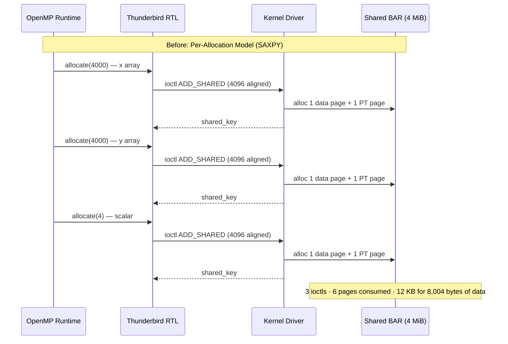
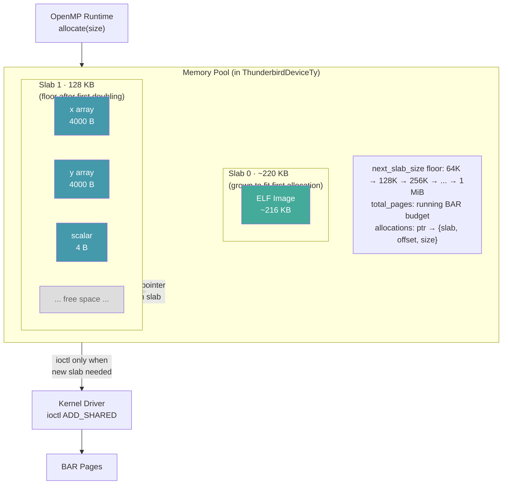
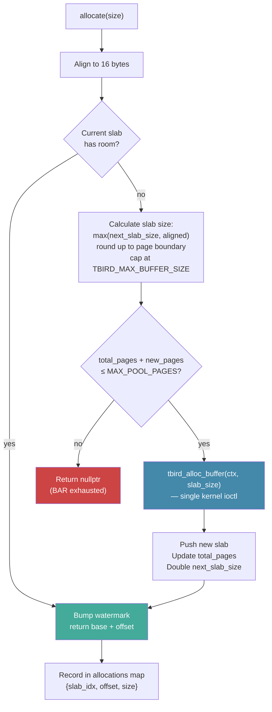
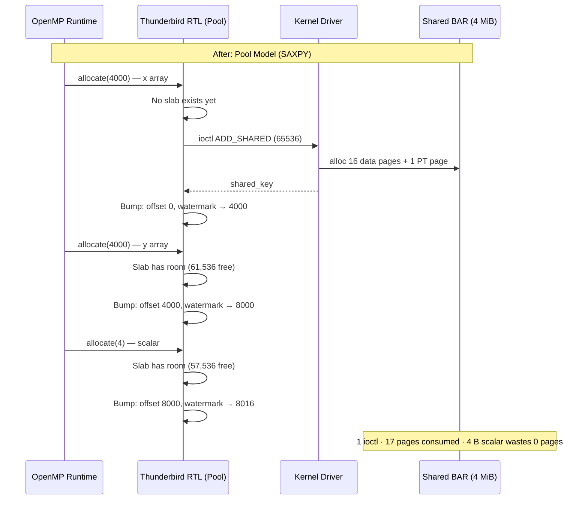
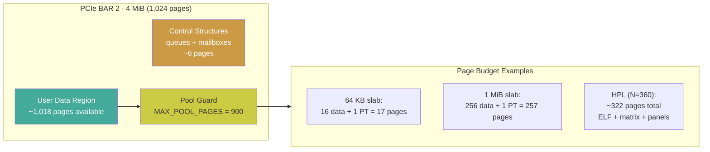
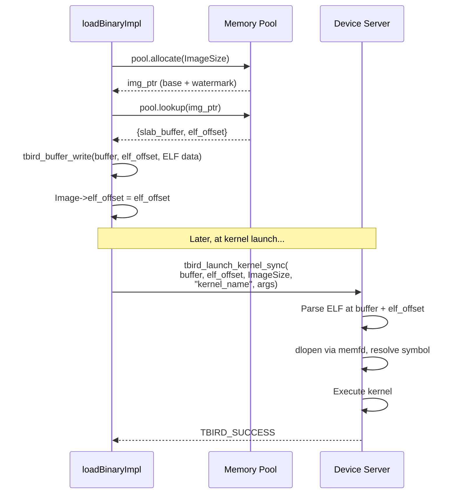
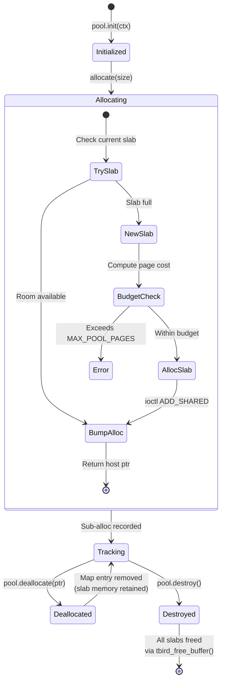

# Thunderbird RTL Memory Pool Design

The Thunderbird OpenMP offload plugin (`libomptarget`) communicates with the RISC-V device through a shared memory region exposed as a PCIe BAR. Every device buffer allocation requires a kernel ioctl (`ADD_SHARED`), which allocates pages in the BAR, builds a page table, and registers the buffer with the device. The memory pool replaces per-allocation ioctls with a bump allocator over a small number of pre-allocated slabs, reducing kernel transitions and page-table overhead while keeping the allocation interface uniform for all consumers (ELF images, data maps, scalars).

## Motivation: Per-Allocation Overhead

Before the pool, every `#pragma omp target map(...)` triggered a separate ioctl to the host kernel driver. For a SAXPY operation with three mapped buffers (x, y, scalar), this meant three round-trips through the ioctl interface, three page-table constructions, and three 4 KB page-aligned allocations — even for a 4-byte scalar.

The scalar allocation is particularly wasteful: 4 bytes of data consumes an entire 4 KB data page plus a 4 KB page-table page — a 2,048x overhead.

## Pool Architecture

The pool pre-allocates large slabs via a single ioctl and sub-allocates within them using a bump pointer. All allocations — ELF images, user data, scalars — go through the pool uniformly. There is no fallback to direct `tbird_alloc_buffer()`.

**Slab sizing.** A new slab is allocated at `max(next_slab_size, requested_size)`, page-aligned, capped at `TBIRD_MAX_BUFFER_SIZE`. `INITIAL_SLAB_SIZE = 64 KB` is the *floor* for the first slab — it is not a hard cap. An HPL run, for example, loads its ~216 KB device ELF through the pool before any data map, so Slab 0 grows to ~220 KB on the very first allocation. After that call, `next_slab_size` doubles to 128 KB, which becomes the floor for Slab 1. The doubling continues up to the 1 MiB per-buffer cap.

## Allocation Flow

When the OpenMP runtime requests a device buffer, the pool first tries to fit it in the current slab. If the slab is full, a new one is allocated from the driver with doubling growth (64 KB → 128 KB → ... → 1 MiB cap). A BAR page budget guard prevents overrunning the 4 MiB shared memory region.

## SAXPY With Pool: 3x Fewer Ioctls

The same SAXPY operation now uses a single slab allocation. The three data buffers are bump-allocated within the slab at different offsets, and all DMA transfers use the slab's `shared_key` with the appropriate offset.

| Metric | Before (per-alloc) | After (pool) | Improvement |
|--------|-------------------|--------------|-------------|
| Kernel ioctls | 3 | 1 | **3x fewer** |
| BAR pages consumed | 6 (3 data + 3 PT) | 17 (16 data + 1 PT) | More data pages, but... |
| Wasted space (scalar) | 4,092 bytes | 0 bytes | **No page-alignment waste** |
| Page-table pages | 3 | 1 | **3x fewer** |
| Total BAR overhead | 24 KB | 68 KB | Higher raw BAR, but fewer ioctls |

The tradeoff: the 64 KB slab uses more BAR space upfront than three 4 KB pages. But the slab is reused across the program lifetime (grow-only), and the ioctl reduction dominates in latency-sensitive paths.

## BAR Budget and Page Math

The 4 MiB BAR is partitioned by the device-side driver into control structures (~24 KB) and user data. Each buffer allocation consumes data pages plus page-table pages (1 PT page per 511 data pages).

The pool enforces a hard limit of 900 pages (~3.5 MiB), leaving ~118 pages of headroom below the 1,018-page BAR capacity. This prevents the pool from consuming the entire BAR and leaving no room for error recovery or unexpected allocations.

## ELF Images and elf_offset

ELF device images (compiled RISC-V kernels) are allocated through the same pool as data buffers. When an image lands at a non-zero offset within a slab, the offset is recorded and passed to `tbird_launch_kernel_sync()` so the device server knows where the ELF starts within the shared buffer.

This unified approach means the pool never needs special-case handling for images vs data — the `elf_offset` parameter in the kernel launch API was already validated by the `test_kernel_elf_offset` test in the offload-platform test suite.

## Lifecycle: Grow-Only with Bulk Release

The pool is grow-only during execution. When the OpenMP runtime calls `free()`, the pool removes the allocation from its tracking map but does not release the slab's DMA memory. Slabs are released in bulk at device shutdown.

This design is appropriate because:
1. The OpenMP runtime reuses device memory via its internal mapping table — actual allocations are rare after the first few target regions
2. HPL pre-maps the entire matrix once and reuses it across hundreds of panel iterations
3. The total memory footprint is bounded by `MAX_POOL_PAGES` regardless of allocation pattern

**Source:** [`llvm-project/offload/plugins-nextgen/thunderbird/src/rtl.cpp`](../../../llvm-project/offload/plugins-nextgen/thunderbird/src/rtl.cpp) (lines 62-188: MemoryPool struct; lines 361, 483, 601, 628, 834: integration points), [`offload-platform/docs/MEMORY_ARCHITECTURE.md`](../../localstore/offload/offload-platform/docs/MEMORY_ARCHITECTURE.md) (BAR layout, page budget)
