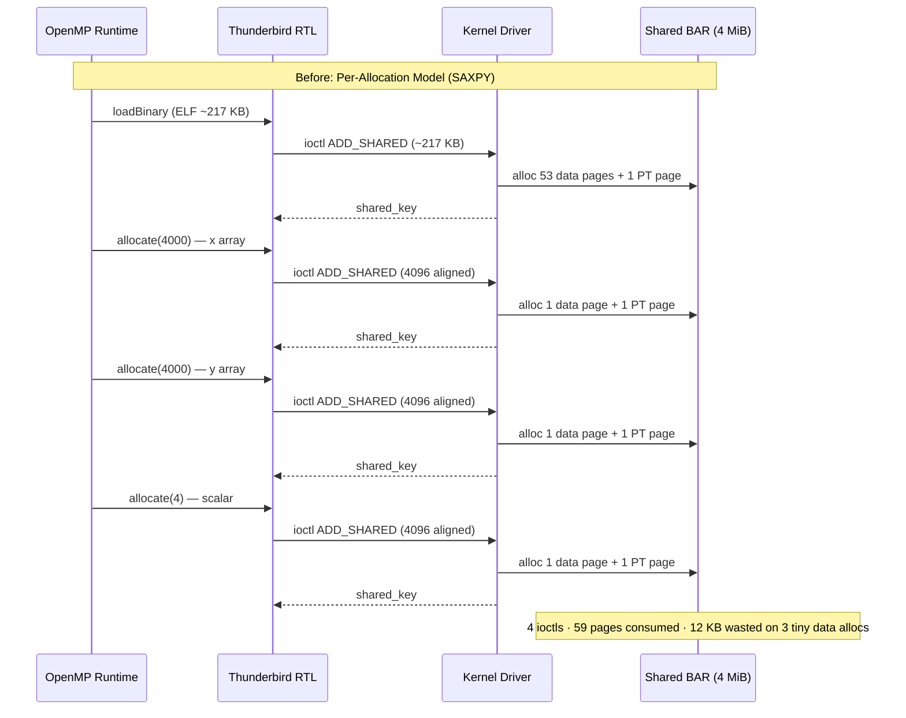
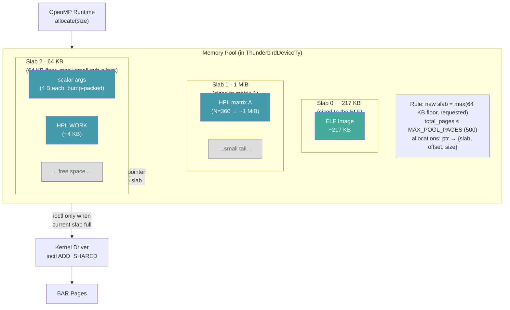
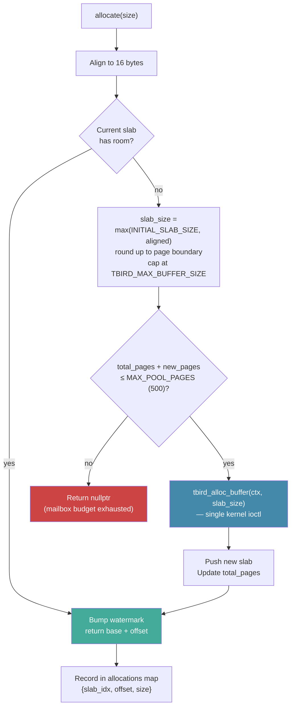
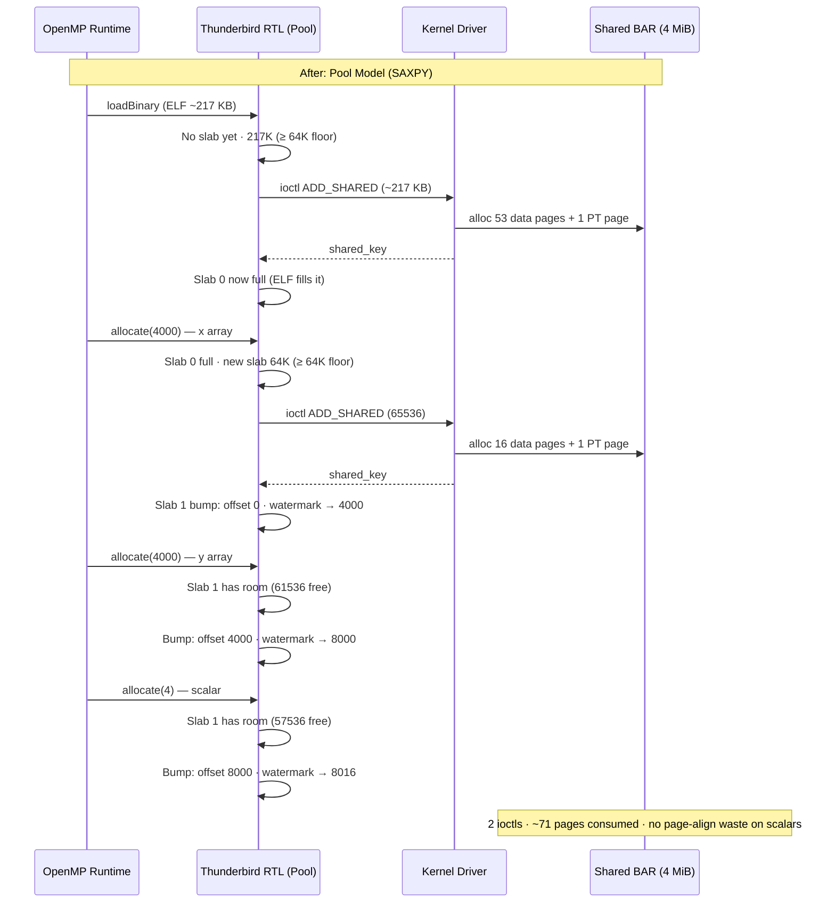
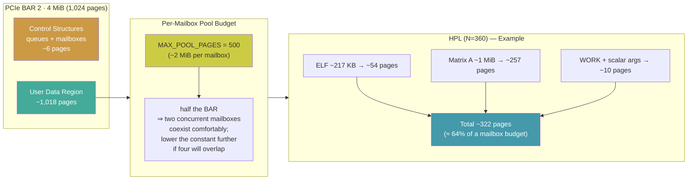
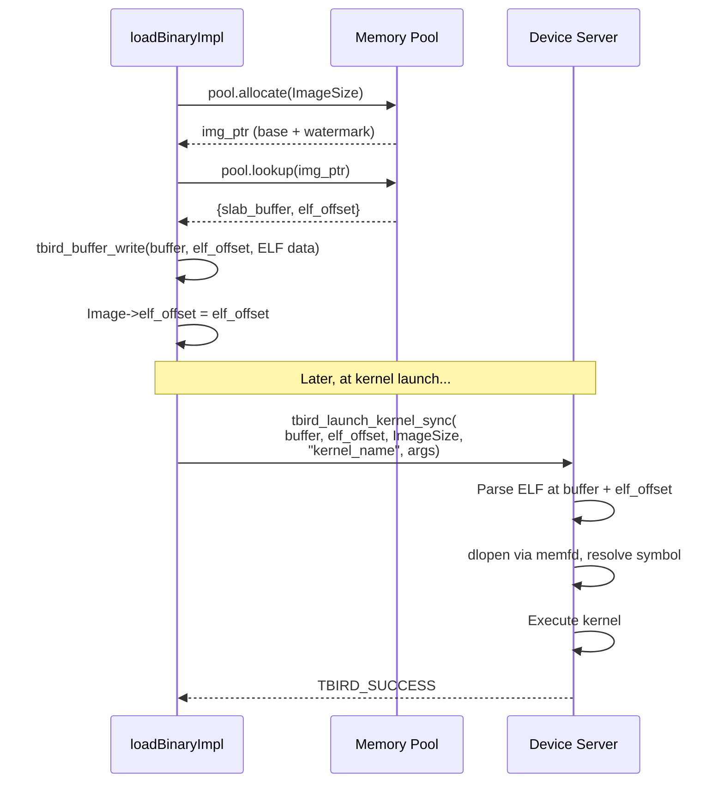
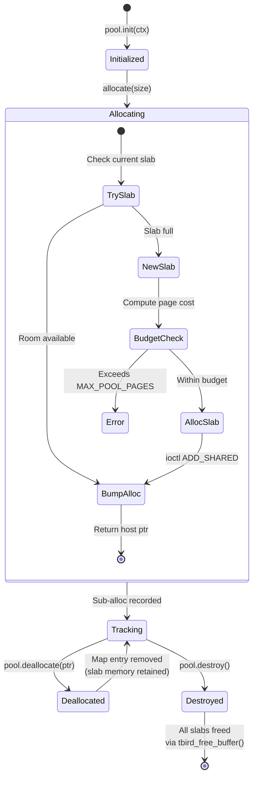

# Thunderbird RTL Memory Pool Design

The Thunderbird OpenMP offload plugin (`libomptarget`) communicates with the RISC-V device through a shared memory region exposed as a PCIe BAR. Every device buffer allocation requires a kernel ioctl (`ADD_SHARED`), which allocates pages in the BAR, builds a page table, and registers the buffer with the device. The memory pool replaces per-allocation ioctls with a bump allocator over a small number of pre-allocated slabs, reducing kernel transitions and page-table overhead while keeping the allocation interface uniform for all consumers (ELF images, data maps, scalars).

## Motivation: Per-Allocation Overhead

Before the pool, every ELF-image load and every `#pragma omp target map(...)`
triggered a separate ioctl to the host kernel driver. For a SAXPY operation
with one ELF plus three data buffers (x, y, scalar), that's four round-trips
through the ioctl interface, four page-table constructions, and three
4 KB-page-aligned data allocations — even for a 4-byte scalar.

The scalar allocation is particularly wasteful: 4 bytes of data consumes an
entire 4 KB data page plus a 4 KB page-table page — a 2,048× overhead.

## Pool Architecture

The pool pre-allocates large slabs via a single ioctl and sub-allocates within them using a bump pointer. All allocations — ELF images, user data, scalars — go through the pool uniformly. There is no fallback to direct `tbird_alloc_buffer()`.

**Slab sizing is stateless.** Every new slab is sized as
`max(64 KB floor, requested)`, page-aligned, capped at
`TBIRD_MAX_BUFFER_SIZE` (1 MiB). There is no `next_slab_size` state,
no doubling, no growth curve — each slab is independently sized to the
request that forced it. Big allocations (ELF ~217 KB, HPL matrix A ~1 MiB)
define their own slab exactly; small allocations land in a 64 KB slab
and amortize the ioctl across many bump-allocations.

## Allocation Flow

When the OpenMP runtime requests a device buffer, the pool tries the current
slab first. If the slab is full, a new one is allocated at
`max(64 KB, requested)` and sanity-checked against the per-mailbox budget.

## SAXPY With Pool: 2 Ioctls vs 4

SAXPY touches one ELF image plus three data buffers. The Before/After
counts include the ELF load as well as the three data maps.

| Metric | Before (per-alloc) | After (pool) | Improvement |
|--------|-------------------|--------------|-------------|
| Kernel ioctls (ELF + 3 data maps) | 4 | 2 | **2× fewer** |
| Scalar (4 B) page waste | 4,092 bytes | 0 bytes | **No page-alignment waste** |
| Page-table pages | 4 | 2 | **2× fewer** |
| Total BAR overhead (SAXPY) | ~236 KB (54 ELF + 3 tiny slabs) | ~284 KB (54 ELF + 17-page data slab) | slightly more BAR, far fewer ioctls |

The tradeoff: the 64 KB data slab allocates more BAR up front than three
isolated 4 KB pages would. In exchange we pay one ioctl instead of three,
and that slab has ~57 KB of headroom to absorb subsequent allocations
without any further kernel transitions. The scalar waste (3 × 4 KB of
padding under the old scheme) disappears entirely.

## BAR Budget and Page Math

The 4 MiB BAR is partitioned by the device-side driver into control
structures (~24 KB, ~6 pages) and a user-data region of ~1,018 pages.
The BAR exposes **four concurrent mailboxes** — each plugin instance
attaches to one. Each instance's pool must therefore leave room for its
peers: a single instance that eats the entire user region would block
any concurrent mailbox from doing useful work.

A fresh slab request past 500 pages returns `nullptr` and propagates up
as an OOM. HPL at the current 1 MiB per-buffer matrix ceiling consumes
~322 pages, leaving ~178 pages of headroom inside a single mailbox's
budget. If future workloads push up against the cap, the right knob to
turn is whichever fits your concurrency story: raise `MAX_POOL_PAGES`
if you expect fewer concurrent mailboxes, or lower it further if four
are expected to share the BAR simultaneously.

## ELF Images and elf_offset

ELF device images (compiled RISC-V kernels) are allocated through the same pool as data buffers. When an image lands at a non-zero offset within a slab, the offset is recorded and passed to `tbird_launch_kernel_sync()` so the device server knows where the ELF starts within the shared buffer.

This unified approach means the pool never needs special-case handling for images vs data — the `elf_offset` parameter in the kernel launch API was already validated by the `test_kernel_elf_offset` test in the offload-platform test suite.

## Lifecycle: Grow-Only with Bulk Release

The pool is grow-only during execution. When the OpenMP runtime calls `free()`, the pool removes the allocation from its tracking map but does not release the slab's DMA memory. Slabs are released in bulk at device shutdown.

This design is appropriate because:
1. The OpenMP runtime reuses device memory via its internal mapping table — actual allocations are rare after the first few target regions
2. HPL pre-maps the entire matrix once and reuses it across hundreds of panel iterations
3. The total memory footprint is bounded by `MAX_POOL_PAGES` regardless of allocation pattern

**Source:** [`llvm-project/offload/plugins-nextgen/thunderbird/src/rtl.cpp`](../../../llvm-project/offload/plugins-nextgen/thunderbird/src/rtl.cpp) (lines 62-188: MemoryPool struct; lines 361, 483, 601, 628, 834: integration points), [`offload-platform/docs/MEMORY_ARCHITECTURE.md`](../../localstore/offload/offload-platform/docs/MEMORY_ARCHITECTURE.md) (BAR layout, page budget)
