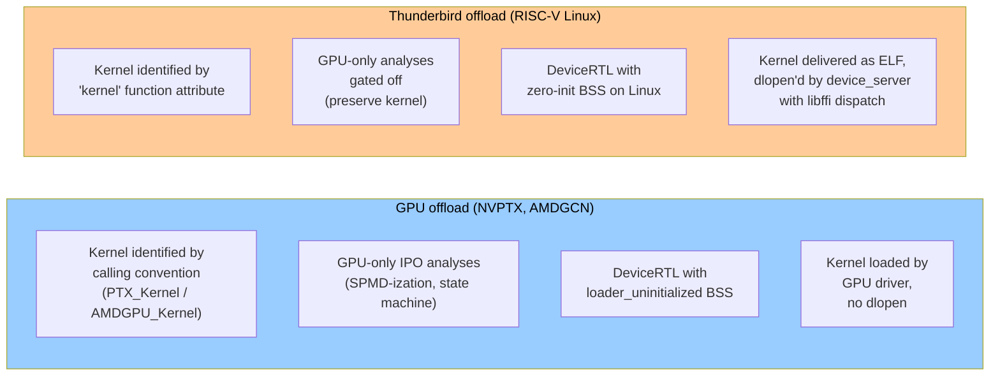
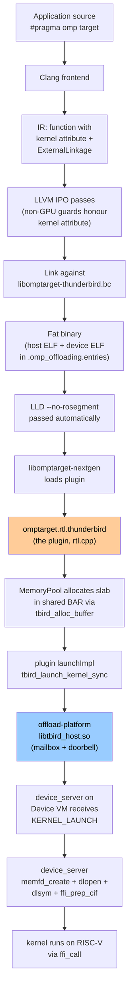

# System Overview

The Thunderbird offload target is a CPU-based accelerator running
RISC-V Linux. To LLVM, though, it looks enough like a
"not-quite-a-GPU" that most of the OpenMP offload machinery applies
unchanged — and the parts that don't survived a long series of
small, targeted fixes to the Clang frontend, the LLVM IPO passes,
and the OpenMP DeviceRTL. This document traces a single
`#pragma omp target` region all the way from source code to device
execution and points at the other documents for detail at each
stage.

## What Thunderbird is to LLVM

Thunderbird targets the triple `riscv64-inspire-linux-gnu`. A user
opts in with `--offload-arch=thunderbird` on a clang command line;
from there clang infers the triple, picks the RISC-V ISA string,
and routes device code through the Thunderbird plugin in
`libomptarget`.

The practical differences from a GPU target:

- **No GPU calling convention.** The kernel entry point is an
  ordinary C function, identified by a `"kernel"` function
  attribute instead of a distinctive calling convention. Many IPO
  passes used the calling convention as their gate; those gates
  were extended to also recognise the attribute.
- **pthread-based parallelism.** `#pragma omp parallel` inside the
  target region dispatches through `__kmpc_fork_call` into
  pthread workers, not onto GPU warps. Any IPO transformation
  that assumed GPU execution semantics had to be disabled on
  non-GPU targets.
- **Dynamically-loaded kernel ELFs.** The device ELF is shipped
  into shared memory at launch time, `dlopen`ed by `device_server`
  via `memfd_create + /proc/self/fd/N`, and invoked through
  `libffi`. The plugin doesn't embed it in the host binary's
  address space.
- **BSS is zero-initialised.** The Linux runtime zero-inits
  globals, so the `[[clang::loader_uninitialized]]` attribute on
  DeviceRTL state globals, which helps on GPUs, causes LLVM to
  propagate `undef` through `@llvm.assume` calls and fold kernels
  to `unreachable` at -O2+.

## End-to-end pipeline

At a glance: clang produces a fat binary with the device half
containing a shared-object ELF for `riscv64-inspire-linux-gnu`.
At runtime libomptarget-nextgen discovers the Thunderbird plugin
(via its RISC-V magic ELF bits), the plugin opens a
`tbird_context` through the offload-platform API, and each kernel
launch marshals arguments into `tbird_arg_t[]` and crosses the
ioctl boundary into the kernel driver. On the device side
`device_server` dlopens the ELF out of shared memory and invokes
the kernel via libffi. The ioctl-and-mailbox half of that
handshake lives in the sibling offload-platform repo under
`simplified-api/presentation_mats/`.

## What lives where in this tree

| Piece | Location |
|---|---|
| Plugin source (rtl.cpp + MemoryPool + ArgumentConversion) | `offload/plugins-nextgen/thunderbird/src/` |
| Plugin build glue (`omptarget.rtl.thunderbird`, `LIBTBIRD_HOST_SO` link) | `offload/plugins-nextgen/thunderbird/CMakeLists.txt` |
| Pool internals deep-dive | `offload/plugins-nextgen/thunderbird/docs/memory_pool_design.md` |
| Clang frontend triple / ISA / linker-flag integration | `clang/lib/Driver/Driver.cpp`, `clang/lib/Driver/ToolChains/Clang.cpp`, `clang/lib/Driver/ToolChains/Arch/RISCV.cpp`, `clang/lib/CodeGen/CGStmtOpenMP.cpp` |
| OpenMP-kernel preservation IPO fixes | `llvm/lib/Transforms/IPO/OpenMPOpt.cpp`, `llvm/lib/IR/Attributes.cpp`, `llvm/lib/Frontend/OpenMP/OMPIRBuilder.cpp`, `llvm/lib/Transforms/IPO/FunctionAttrs.cpp` |
| DeviceRTL pieces that differ for Thunderbird | `offload/DeviceRTL/src/Configuration.cpp`, `offload/DeviceRTL/src/State.cpp`, `offload/DeviceRTL/CMakeLists.txt` |

The rest of DeviceRTL (Mapping, Synchronization, Parallelism, etc.)
is used as-is by the Thunderbird target; the pthread adaptation
happens at the OS-library level under the DeviceRTL, not inside it.

## What the next documents cover

- [`02_clang_driver.md`](02_clang_driver.md) — how
  `--offload-arch=thunderbird` reaches the right toolchain,
  triple, ISA, linker flags, and how CGStmtOpenMP handles
  outlined parallel functions for non-GPU targets.
- [`03_openmp_kernel_preservation.md`](03_openmp_kernel_preservation.md) —
  the five-part fix across OpenMPOpt, OMPIRBuilder, DAE, and
  FunctionAttrs that stops LLVM's IPO pipeline from eliminating
  non-GPU OpenMP kernels at -O1+.
- [`04_device_rtl.md`](04_device_rtl.md) — what compiles into
  `libomptarget-thunderbird.bc`, the `OMPTARGET_DEVICE_THUNDERBIRD`
  macro, and the Linux-BSS-vs-GPU-undef guard on
  `[[clang::loader_uninitialized]]`.
- [`05_plugin_architecture.md`](05_plugin_architecture.md) —
  `rtl.cpp` itself: the five subclasses of the
  libomptarget-nextgen framework, the kernel-launch path, and
  memory / data-motion dispatch.
- [`06_memory_pool_and_arg_conversion.md`](06_memory_pool_and_arg_conversion.md) —
  the two helper modules that make the plugin fast enough, and
  how arguments get marshaled between the OpenMP and tbird
  conventions.

## What this set does not cover

- **Kernel ELF loading on the device.** Covered in the sibling
  offload-platform repo under
  `simplified-api/presentation_mats/05_device_server.md` and
  `06_device_runtime.md`.
- **Orchestration of the Host and Device VMs.** Covered in
  offload-debug's `CLAUDE.md` and its own `presentation_mats/`.
- **The modular `.a`-per-function BLAS design** that offload-blas
  layers on top of these pieces. Covered in offload-blas's
  `presentation_mats/`.

**Source:** [`offload/plugins-nextgen/thunderbird/`](../),
[`docs/memory_pool_design.md`](../docs/memory_pool_design.md).
