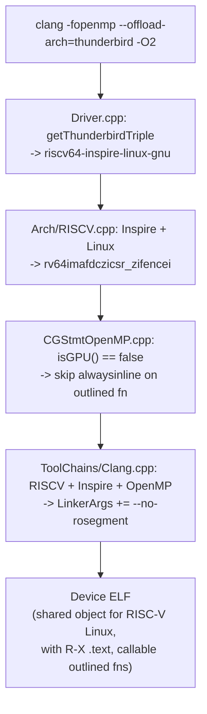

# Clang Driver and Frontend Integration

When a user compiles with `--offload-arch=thunderbird`, four
separate places in clang need to agree on what that means: the
driver that picks the toolchain for the device half of the build,
the RISC-V arch selector that picks the ISA string, the offload
linker step that passes device-specific flags, and the OpenMP code
generator that decides how to emit the outlined parallel functions.
This document walks each site.

## Offload-arch parsing and triple inference

`clang/lib/Driver/Driver.cpp` contains a dedicated helper that
infers a device triple from the host triple when the user opts in
with only the arch name (no explicit `--offload-triple`):

```cpp
static llvm::Triple
getThunderbirdTriple(const llvm::Triple &HostTriple) {
  // Match host pointer width to choose rv32 vs rv64.
  return llvm::Triple(HostTriple.isArch64Bit()
                          ? "riscv64-inspire-linux-gnu"
                          : "riscv32-inspire-linux-gnu");
}
```

Three points worth noting:

1. **Inspire vendor.** The triple uses `inspire` where upstream
   RISC-V Linux targets would use `unknown`
   (`riscv64-unknown-linux-gnu`). The `Inspire` vendor enum value
   is what the Thunderbird code paths in other parts of clang key
   off (see the linker and ISA sections below), so the vendor is
   load-bearing, not cosmetic.
2. **`-linux-gnu`, not `-elf`.** Thunderbird runs full Linux with
   pthreads and the GNU C library. A bare-metal triple would miss
   pthread support and the Linux-specific ABI conventions that
   DeviceRTL's non-GPU branch relies on.
3. **Matches the Yocto sysroot naming.** meta-inspire's
   `nativesdk-llvm-offload-thunderbird` recipe stages a sysroot
   at exactly this triple, so the toolchain file and the clang
   driver agree on what path to look up.

The offload-arch string `thunderbird` is detected
case-insensitively, and variants like `thunderbird+...` are
accepted as a forward-compatible prefix match for future
sub-architecture flags (nothing uses this yet, but the parsing
side is future-proof).

## ISA string selection

`clang/lib/Driver/ToolChains/Arch/RISCV.cpp` picks the RISC-V ISA
string for the device compiler based on the triple. For Thunderbird:

```cpp
// Thunderbird/Inspire: rv64gc = rv64imafd + c + zicsr + zifencei
// Thunderbird (Inspire vendor) uses rv64imafdczicsr_zifencei for Linux targets
if (Triple.getVendor() == llvm::Triple::Inspire && Triple.isOSLinux())
  return "rv64imafdczicsr_zifencei";
```

Expanded:

- `rv64i` — base 64-bit integer ISA
- `m` — integer multiply/divide
- `a` — atomic instructions
- `f` — single-precision floating-point
- `d` — double-precision floating-point
- `c` — 16-bit compressed instructions
- `zicsr` — control and status register access (needed for timer
  reads, interrupt returns, etc. under a real Linux kernel)
- `zifencei` — instruction-fence (required for self-modifying code
  and, more practically, for dynamic loaders like `dlopen` to
  correctly invalidate the instruction cache after writing an ELF
  into `memfd`)

The underscore separator is part of the ISA string grammar; LLVM
requires `zicsr_zifencei` not `zicsrzifencei`.

## Offload device-linker flags

`clang/lib/Driver/ToolChains/Clang.cpp` builds the command line for
the device linker (lld). One Thunderbird-specific flag is
auto-injected:

```cpp
// Thunderbird device ELFs are loaded via dlopen()/memfd which respects
// PT_LOAD segment permissions.  LLD's rosegment (enabled by default)
// splits R-- and R-X sections into separate segments; at -O2+ this
// puts .text in a non-executable segment, causing page faults.
// Disable rosegment so R-- and R-X sections share one R-X segment.
// (Same issue as Android API < 29 — see Linux.cpp)
if (Kind == Action::OFK_OpenMP &&
    TC->getTriple().isRISCV() &&
    TC->getTriple().getVendor() == llvm::Triple::Inspire)
  LinkerArgs.emplace_back("--no-rosegment");
```

### Why `--no-rosegment` matters here

Modern lld defaults to the "rosegment" layout where read-only
non-executable sections (like `.rodata`) go in one `PT_LOAD`
segment and executable sections (like `.text`) go in another, with
distinct page-protection bits. On a Linux process that mmaps the
ELF, this is ideal — unused pages stay non-executable and W^X is
preserved.

`device_server` does not do a normal ELF mmap. It writes the ELF
bytes into a `memfd`, then calls `dlopen("/proc/self/fd/N", …)`.
The dynamic loader honours the `PT_LOAD` permissions and maps
`.text` exactly as the ELF asks. At -O2+, clang produces a device
ELF where `.text` has landed in an `R--` (read-only,
non-executable) segment for reasons rooted in how
`--offload-arch=thunderbird` marks up its device sections; the
result is a page fault the first time `ffi_call` tries to execute
the kernel's entry point.

Flipping `--no-rosegment` on merges `R--` and `R-X` sections into
a single `R-X` segment. That's a short-term workaround from lld's
perspective but exactly what we need for a device loader that can't
distinguish between "code" and "rodata" at `dlopen` time.

The Android < 29 linker has an analogous issue; the clang comment
points at that as the precedent.

## OpenMP outlined-function inlining

`clang/lib/CodeGen/CGStmtOpenMP.cpp` emits the *outlined*
functions that `#pragma omp parallel` regions generate. For GPU
targets these are marked `alwaysinline` so they fold into the
kernel's state machine; for non-GPU targets that would break the
dispatch mechanism:

```cpp
// Always inline the outlined function if optimizations are enabled.
// For non-GPU device targets (e.g. Thunderbird/RISC-V pthread-based offload),
// skip alwaysinline: the outlined function runs on separate pthreads and must
// remain a callable function pointer passed to __kmpc_fork_call.  Inlining it
// makes the callback argument dead, which DAE then replaces with poison,
// introducing UB that folds the kernel entry into unreachable.
if (CGM.getCodeGenOpts().OptimizationLevel != 0 &&
    CGM.getOpenMPRuntime().isGPU()) {
  F->removeFnAttr(llvm::Attribute::NoInline);
  F->addFnAttr(llvm::Attribute::AlwaysInline);
}
```

### Why inlining breaks the non-GPU path

The OpenMP runtime compiles `#pragma omp parallel { body }` into:

1. Clang hoists `body` into an outlined function
   `__outlined_fn(…args…)`.
2. The kernel calls
   `__kmpc_fork_call(&__outlined_fn, nargs, …args…)`.
3. On GPU, `__kmpc_fork_call` is optimised away as part of
   state-machine rewriting, and `__outlined_fn` is inlined
   directly into the kernel.
4. On non-GPU, `__kmpc_fork_call` is a real call that dispatches
   `__outlined_fn` to a pthread worker.

If step 4 is the destination, `__outlined_fn` must remain
*callable* — i.e. must have its address taken, must retain its
parameter signature. If we `alwaysinline` it under step 3's
assumptions, then on non-GPU builds its one call site (inside the
kernel) gets folded away; DAE then notices
`&__outlined_fn` has no users, replaces its function pointer arg
to `__kmpc_fork_call` with poison, and InstCombine folds the whole
thing to `unreachable`. The kernel is dead.

The fix is minimal: gate the `alwaysinline` on
`CGM.getOpenMPRuntime().isGPU()`.

## Putting it together

A clang invocation like:

```
clang -fopenmp --offload-arch=thunderbird -O2 src.c -o app
```

runs through these four sites as follows:



Three changes shape the compiler's knowledge of the target (the
triple, the ISA, the linker flag) and one shapes what it emits for
a particular construct (outlined parallel functions).
`03_openmp_kernel_preservation.md` covers the next stage — the IPO
passes the device IR flows through after codegen — which needed
more invasive work.

**Source:** [`clang/lib/Driver/Driver.cpp`](../../../../clang/lib/Driver/Driver.cpp)
(`getThunderbirdTriple`),
[`clang/lib/Driver/ToolChains/Arch/RISCV.cpp`](../../../../clang/lib/Driver/ToolChains/Arch/RISCV.cpp),
[`clang/lib/Driver/ToolChains/Clang.cpp`](../../../../clang/lib/Driver/ToolChains/Clang.cpp),
[`clang/lib/CodeGen/CGStmtOpenMP.cpp`](../../../../clang/lib/CodeGen/CGStmtOpenMP.cpp).
