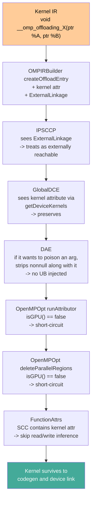

# OpenMP Kernel Preservation for Non-GPU Targets

At -O1 and higher, LLVM's IPO pipeline aggressively eliminates
anything that isn't demonstrably live. The GPU-targeted OpenMP
offload path has been built up over years such that a kernel entry
point is recognisable to every pass that matters — either by a
distinctive calling convention (PTX_Kernel, AMDGPU_Kernel) or by
attributes those passes specifically whitelist. A non-GPU offload
target inherits none of that protection out of the box.

The result, pre-fix, was that a Thunderbird build at -O1+ would
compile cleanly, link cleanly, and then execute a kernel that had
been folded to `unreachable` somewhere between codegen and the final
fat binary. The device image looked valid — it had an entry point,
it had debug info, it was the right size — but the entry point's
first instruction was an illegal `ud2` / `ebreak`-equivalent.

Five separate changes across OMPIRBuilder, OpenMPOpt, DAE, and
FunctionAttrs preserve the kernel. This document walks each one and
then traces a single kernel through the pipeline to show where each
fix intervenes.

## Why GPU-centric IPO eliminates non-GPU kernels

Two conventions let GPU kernels survive the IPO passes:

1. **Calling convention.** A function with calling convention
   `PTX_Kernel` or `AMDGPU_Kernel` is treated by most LLVM passes
   as an externally-reachable entry point. It is preserved even
   when there are no direct call sites in the module (the GPU
   driver finds it by name / symbol, not by call graph).

2. **IR attributes on the kernel.** Several GPU-specific
   attributes — `uniform-work-group-size`, MustProgress markers,
   amdgpu-queue attributes, etc. — cause passes like the
   Attributor to recognise and protect the function.

A non-GPU OpenMP device kernel has neither. It's a `void(…)`
function with the ordinary C calling convention, and before these
fixes it had no attribute distinguishing it from any other function
in the module. So:

- **GlobalDCE** sees no direct call sites, marks it unreferenced,
  deletes it.
- **IPSCCP** sees only a `ConstantExpr` reference in the offload
  entries struct, concludes there's no real caller, marks the
  entry block `unreachable`, and wipes the body on the next
  DCE pass.
- **FunctionAttrs** sees the kernel's pointer parameters threading
  through `__kmpc_fork_call`'s varargs to the outlined function,
  concludes they're never actually read or written (the varargs
  opacity defeats the alias analysis), and adds `readnone` to
  them. Later passes use that to fold loads to `undef`.
- **DAE** sees arguments whose only consumer is the OpenMP runtime
  dispatcher, considers them dead, and replaces them with
  `poison`. Any `nonnull` attribute on the poisoned argument then
  triggers UB, which InstCombine folds to `unreachable`.

Every one of these passes is doing correct analysis given its
inputs. The fix in each case is to give it enough information that
a non-GPU kernel isn't mistaken for dead code.

## Fix 1: kernel identification

### Emit the `"kernel"` attribute (OMPIRBuilder)

`llvm/lib/Frontend/OpenMP/OMPIRBuilder.cpp::createOffloadEntry` is
the one place in the LLVM frontend where an offload entry is
recorded. For non-GPU targets it now adds two things to the kernel
function:

```cpp
if (!Config.isGPU()) {
  // Mark the function as a kernel entry point so that OpenMPOpt's
  // getDeviceKernels() includes it in the Kernels set.  GPU targets are
  // protected by their kernel calling conventions (amdgpu_kernel / spir_func)
  // which IPSCCP treats as externally reachable.  Non-GPU targets (e.g.
  // RISC-V / Thunderbird) have no special calling convention, so:
  //   1. Add the "kernel" attribute for OpenMPOpt identification.
  //   2. Set ExternalLinkage so IPSCCPPass treats the function as potentially
  //      called from outside the module.  Without this, IPSCCP sees no direct
  //      call sites (the function is only referenced by address in the offload
  //      entry struct) and marks the entry block unreachable, wiping the body.
  if (Function *Fn = dyn_cast<Function>(Addr)) {
    Fn->addFnAttr("kernel");
    Fn->setLinkage(GlobalValue::ExternalLinkage);
  }
  // ...
  return;
}
// GPU path continues and also adds the "kernel" attr plus
// GPU-specific MustProgress, uniform-work-group-size, etc.
```

The `"kernel"` attribute is the string every subsequent pass looks
at. Both GPU and non-GPU targets emit it now; GPU targets were
always doing so indirectly, the non-GPU branch just makes it
explicit. `ExternalLinkage` is the IPSCCP fix specifically —
without it, IPSCCP's interprocedural-sparse-conditional-constant-
propagation analysis sees no inbound direct calls and concludes
the function entry block is unreachable.

### Look for the attribute (OpenMPOpt)

`llvm/lib/Transforms/IPO/OpenMPOpt.cpp::getDeviceKernels` originally
gated kernel discovery by `hasKernelCallingConv()`, which excluded
non-GPU targets by construction:

```cpp
bool llvm::omp::isOpenMPKernel(Function &Fn) {
  return Fn.hasFnAttribute("kernel");
}

KernelSet llvm::omp::getDeviceKernels(Module &M) {
  KernelSet Kernels;

  for (Function &F : M) {
    // Use the "kernel" attribute as the sole criterion for identifying OpenMP
    // kernel entry points.  The original hasKernelCallingConv() gate excluded
    // non-GPU targets (e.g. RISC-V / Thunderbird) that use the C calling
    // convention, causing their kernels to be internalized and then removed by
    // GlobalDCE at -O1+.
    //
    // The "kernel" attribute remains the correct discriminator: CUDA kernels
    // linked with OpenMP code have a kernel calling convention (PTX_Kernel)
    // but do NOT have the "kernel" attribute, so they are still excluded.
    if (!isOpenMPKernel(F))
      continue;
    ++NumOpenMPTargetRegionKernels;
    Kernels.insert(&F);
  }

  return Kernels;
}
```

The subtlety worth keeping in mind: CUDA kernels that share a
translation unit with OpenMP code do have a kernel calling
convention (`PTX_Kernel`) but do *not* have the `"kernel"`
attribute, so they're still excluded — which is what we want.
OpenMPOpt shouldn't be running its analyses on CUDA kernels.

**Source:** [`llvm/lib/Frontend/OpenMP/OMPIRBuilder.cpp`](../../../../llvm/lib/Frontend/OpenMP/OMPIRBuilder.cpp),
[`llvm/lib/Transforms/IPO/OpenMPOpt.cpp`](../../../../llvm/lib/Transforms/IPO/OpenMPOpt.cpp).

## Fix 2: Attributor scope

OpenMPOpt runs the Attributor framework with a set of
GPU-specific Abstract Attributes (AAKernelInfo, AAExecutionDomain,
AAIsDead, …) that assume warp-level synchronisation, SPMD
execution, and GPU memory models. None of that applies to a
pthread-based target, and some of the transformations actively
corrupt the kernel — SPMD-ization rewrites the state machine
assuming warp masks, AAIsDead marks blocks as dead based on GPU
thread divergence that doesn't exist on CPU, and so on.

`OpenMPOpt.cpp::runAttributor` now short-circuits for non-GPU
targets:

```cpp
bool runAttributor(bool IsModulePass) {
  if (SCC.empty())
    return false;

  // Skip Attributor-based optimizations for non-GPU device targets.
  //
  // Non-GPU targets like Thunderbird (RISC-V) DO use the OpenMP device
  // runtime (__kmpc_target_init, __kmpc_parallel_51, etc.) but with a
  // pthread-based execution model rather than GPU warps/SIMT. The OpenMPOpt
  // Attributor analysis (AAKernelInfo, AAExecutionDomain, AAIsDead, etc.)
  // performs transformations that assume GPU execution semantics.
  //
  // These GPU-specific transformations incorrectly eliminate or transform
  // code on non-GPU targets. The guard must apply to BOTH module-level and
  // CGSCC-level Attributor invocations; the CGSCC pass (IsModulePass=false)
  // also registers and runs GPU-specific AAs via registerAAsForFunction().
  if (isOpenMPDevice(M) && !OMPInfoCache.OMPBuilder.Config.isGPU()) {
    LLVM_DEBUG(dbgs() << TAG
                      << "Skipping Attributor for non-GPU device target\n");
    return false;
  }
  // ... continues with Attributor instantiation ...
}
```

The guard must hit both the module-level and CGSCC-level Attributor
invocations — an earlier partial fix only covered the module pass,
and the CGSCC path still invoked GPU-specific analyses through
`registerAAsForFunction`.

Once Attributor is off, SPMD-ization, state-machine rewriting,
cross-thread synchronization deductions, and divergence-based dead
block elimination all stop running on non-GPU device code.

## Fix 3: deleteParallelRegions guard

OpenMPOpt's `deleteParallelRegions` optimisation tries to collapse
away `__kmpc_fork_call`s whose outlined function is trivial enough
to be subsumed into the kernel. On GPU that's desirable — the fork
is an artifact of the OpenMP lowering, and on the device it costs
nothing once the state machine has been rewritten.

On non-GPU, `__kmpc_fork_call` *is the dispatch mechanism*. It
hands the outlined function pointer to a pthread worker. Deleting
it removes the parallelism entirely.

The guard is a two-line gate at the top of the transformation:

```cpp
if (isOpenMPDevice(M) && !OMPInfoCache.OMPBuilder.Config.isGPU())
  return false;
```

## Fix 4: DAE and `NonNull`

DeadArgumentElimination replaces arguments that have no uses with
`poison`. Before doing so, it strips "UB-implying attributes" from
the argument — any attribute that, combined with `poison`, would
make the program immediate UB. `nonnull` is such an attribute: a
`nonnull poison` value is UB on first use.

Before the fix, `getUBImplyingAttributes` missed `NonNull`:

```cpp
AttributeMask AttributeFuncs::getUBImplyingAttributes() {
  AttributeMask AM;
  AM.addAttribute(Attribute::NoUndef);
  AM.addAttribute(Attribute::Dereferenceable);
  AM.addAttribute(Attribute::DereferenceableOrNull);
  AM.addAttribute(Attribute::NonNull);  // <-- added by the fix
  return AM;
}
```

So when DAE replaced a dead `nonnull` pointer argument with
`poison`, the `nonnull` stayed, the argument was immediately UB,
and InstCombine folded everything reachable from that argument —
including the kernel's entry — to `unreachable`.

This fix is tiny (one line) but affects all of LLVM, not just
non-GPU OpenMP. It's included here because the non-GPU OpenMP path
was where the bug was first observed.

**Source:** [`llvm/lib/IR/Attributes.cpp`](../../../../llvm/lib/IR/Attributes.cpp)
(`getUBImplyingAttributes`).

## Fix 5: FunctionAttrs skip for kernel SCCs

FunctionAttrs infers `readnone` / `readonly` / `writeonly` on
function parameters by walking the call graph and checking how the
parameter is used. For a device kernel whose parameters are passed
through `__kmpc_fork_call`'s varargs into an outlined function,
the alias chain is too opaque — FunctionAttrs gives up correctly
reading through the varargs and incorrectly concludes the parameter
is neither read nor written (defaulting to `readnone` for an opaque
chain is a soundness error in this corner case).

With `readnone` on a kernel parameter, later passes fold loads
through that pointer to `undef`, which propagates and eventually
wipes the kernel.

The fix skips the inference entirely for any SCC that contains a
function with the `"kernel"` attribute:

```cpp
// Do not infer read/write access attributes for device kernel entry points
// (functions with the "kernel" attribute). The alias chain from kernel
// pointer parameters through __kmpc_fork_call's varargs to the actual
// memory access is too complex for FunctionAttrs to track correctly,
// causing false readnone inference that eliminates the kernel body.
// Kernel entry parameters must be conservatively treated as read/written.
bool IsKernelSCC = llvm::any_of(ArgumentSCC, [](const ArgumentGraphNode *N) {
  return N->Definition->getParent()->hasFnAttribute("kernel");
});
if (IsKernelSCC)
  continue;
```

Kernel parameters are conservatively treated as read/written, which
means later passes assume every pointer arg might be accessed, and
don't fold.

**Source:** [`llvm/lib/Transforms/IPO/FunctionAttrs.cpp`](../../../../llvm/lib/Transforms/IPO/FunctionAttrs.cpp).

## Pipeline trace: a kernel surviving each fix



Reading the diagram: every fix sits at the single pass that would
otherwise have damaged the kernel. None of them is aggressive — no
optimisation is disabled wholesale; each pass is taught either to
recognise the kernel (fixes 1, 5) or to short-circuit its GPU-only
logic on non-GPU targets (fixes 2, 3). Fix 4 is the one unrelated
to GPU-vs-non-GPU — a latent bug in DAE that the non-GPU path
happened to trip.

## Regression surface

Each of these fixes is narrowly scoped and behaves identically on
GPU targets. A regression in any one of them eliminates non-GPU
kernels at the optimisation level where that specific fix is
load-bearing:

- OMPIRBuilder regression → kernels disappear at the earliest DCE
  pass (no `"kernel"` attribute means nobody protects them).
- OpenMPOpt getDeviceKernels regression → kernels disappear under
  GlobalDCE at -O1+.
- OpenMPOpt runAttributor regression → kernels get their state
  machine rewritten with GPU assumptions; symptom varies by
  kernel shape.
- OpenMPOpt deleteParallelRegions regression → kernels lose their
  parallel dispatch, typically running serially in a single
  thread at best.
- Attributes.cpp regression → an unrelated LLVM bug in DAE
  resurfaces; symptom is `unreachable` at any optimisation level
  high enough to trigger DAE + InstCombine fusion.
- FunctionAttrs regression → kernels load `undef` from their
  parameters and get folded.

The fixes individually are small. Together they define the
contract between "this is an OpenMP device kernel" and "the IPO
pipeline respects it," without a GPU calling convention as the
shortcut.
