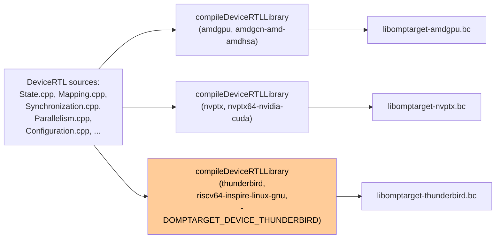

# DeviceRTL for Thunderbird

The OpenMP DeviceRTL is the tiny runtime that every offload target
links against — it provides the `__kmpc_target_init`,
`__kmpc_parallel_51`, team-state bookkeeping, and synchronisation
primitives that OpenMP's generated code calls into. Most of it
compiles unchanged for Thunderbird. Two files have small but
essential Thunderbird-specific guards, and the DeviceRTL CMake
machinery takes one extra target variant.

## What gets built: `libomptarget-thunderbird.bc`

`offload/DeviceRTL/CMakeLists.txt` builds the DeviceRTL once per
offload target. Each variant is a separate LLVM bitcode archive
that the fat-binary linker pulls in for the matching
`--offload-arch`.



The top-level dispatch in `offload/DeviceRTL/CMakeLists.txt` lines
up like this:

```cmake
if(NOT LLVM_TARGETS_TO_BUILD OR "AMDGPU" IN_LIST LLVM_TARGETS_TO_BUILD)
  compileDeviceRTLLibrary(amdgpu amdgcn-amd-amdhsa -Xclang -mcode-object-version=none)
endif()

if(NOT LLVM_TARGETS_TO_BUILD OR "NVPTX" IN_LIST LLVM_TARGETS_TO_BUILD)
  compileDeviceRTLLibrary(nvptx nvptx64-nvidia-cuda --cuda-feature=+ptx63)
endif()

if(NOT LLVM_TARGETS_TO_BUILD OR "RISCV" IN_LIST LLVM_TARGETS_TO_BUILD)
  # Thunderbird is a CPU-based RISC-V accelerator running Linux that uses
  # traditional fork-join parallelism with pthreads rather than GPU SPMD model
  if(DEFINED LIBOMPTARGET_DEVICE_SYSROOT AND NOT "${LIBOMPTARGET_DEVICE_SYSROOT}" STREQUAL "")
    compileDeviceRTLLibrary(thunderbird riscv64-inspire-linux-gnu -DOMPTARGET_DEVICE_THUNDERBIRD)
  else()
    message(WARNING "Skipping Thunderbird DeviceRTL: LIBOMPTARGET_DEVICE_SYSROOT not set.")
  endif()
endif()
```

Three things to notice:

1. **Sysroot required.** Thunderbird compilation needs a
   `LIBOMPTARGET_DEVICE_SYSROOT` pointing at a RISC-V Linux sysroot
   with pthread support. GPU targets use `-nostdlibinc`; Thunderbird
   needs standard C headers for pthreads, `dlopen`, and `memfd`.
2. **`OMPTARGET_DEVICE_THUNDERBIRD` macro.** Passed as a `-D` flag
   to the bitcode compilation; DeviceRTL sources key off it to
   adjust Linux-versus-GPU behaviour (see next two sections).
3. **Flags for dynamic loading.** The per-target flag helper adds
   `-ftls-model=global-dynamic` and `-fno-pie` for Thunderbird —
   the device ELF is loaded via `dlopen`, so TLS variables need
   relocations compatible with shared libraries (`R_RISCV_TLSGD`)
   rather than local-exec, and the PIE level must stay unset to
   prevent `TargetMachine::getTLSModel` from picking LocalExec.

## The `OMPTARGET_DEVICE_THUNDERBIRD` guard in Configuration.cpp

`offload/DeviceRTL/src/Configuration.cpp` declares the global
`__omp_rtl_device_environment` symbol that the plugin writes to at
kernel-launch time. For GPUs, the declaration has default
visibility:

```cpp
// This variable should be visible to the plugin so we override the default
// hidden visibility.
#ifdef OMPTARGET_DEVICE_THUNDERBIRD
// For Thunderbird (CPU-based), we need external linkage for weak symbols
extern "C" [[gnu::used, gnu::retain, gnu::weak,
  gnu::visibility("protected")]] Constant<DeviceEnvironmentTy>
    __omp_rtl_device_environment = {};
#else
[[gnu::used, gnu::retain, gnu::weak,
  gnu::visibility("protected")]] Constant<DeviceEnvironmentTy>
    __omp_rtl_device_environment;
#endif
```

Two differences under the guard:

- **`extern "C"` linkage.** The symbol needs to be findable by
  exactly `__omp_rtl_device_environment` — not a C++-mangled name.
  `device_server` resolves this via `dlsym` and needs the
  unmangled symbol in the dynamic table.
- **Zero-initialiser (`= {}`).** On GPU, the symbol is declared
  uninitialised; the plugin writes to it before kernel launch and
  the GPU loader doesn't zero-init globals. On Linux, BSS is
  zero-initialised by the OS loader before any user code runs; the
  explicit `= {}` keeps the variable in `.bss` rather than leaving
  its storage class unspecified, which a shared-object link would
  resolve differently.

The `[[gnu::visibility("protected")]]` attribute is common to both
paths — it tells the dynamic loader that the symbol is not meant
to be preemptable by another shared object, which matches our
single-kernel-ELF model.

## The `loader_uninitialized` guard in State.cpp

`offload/DeviceRTL/src/State.cpp` holds the DeviceRTL's central
state objects: `TeamState` (per-team config, mode, runtime
policies) and `ThreadStates` (per-thread local storage). Both are
declared as globals. On GPU targets, they use the
`[[clang::loader_uninitialized]]` attribute:

```cpp
// On GPU targets, device memory is not zero-initialized by the loader, so
// loader_uninitialized avoids costly zero-init. On Linux-based targets (e.g.
// Thunderbird/RISC-V pthread), BSS IS zero-initialized by the OS. Using
// loader_uninitialized on Linux causes GlobalOpt to propagate undef for reads
// before any write, which leaks into @llvm.assume calls and triggers UB that
// folds device kernels to unreachable at -O2+.
#if defined(__nvptx__) || defined(__amdgcn__)
[[clang::loader_uninitialized]] Local<state::TeamStateTy>
    ompx::state::TeamState;
[[clang::loader_uninitialized]] Local<state::ThreadStateTy **>
    ompx::state::ThreadStates;
#else
Local<state::TeamStateTy> ompx::state::TeamState;
Local<state::ThreadStateTy **> ompx::state::ThreadStates;
#endif
```

### Why the guard matters at -O2+

`[[clang::loader_uninitialized]]` promises the compiler that the
variable's storage is uninitialised when the kernel starts. On a
GPU, that's true — the device loader doesn't waste bandwidth
zero-initialising buffers that will be written before they're
read.

On Linux, BSS zero-initialisation is mandatory. If the DeviceRTL
declares a variable as loader-uninitialised but the Linux loader
still zeros it, we've told the compiler a false promise.
Specifically: the optimizer takes `loader_uninitialized` as "reads
before writes return `undef`," and a chain of passes takes that
`undef` and propagates it into `@llvm.assume(…)` calls that
DeviceRTL itself emits (e.g. to assert thread ID invariants). An
`@llvm.assume(undef)` is UB, and at -O2+ the optimizer folds the
surrounding basic block to `unreachable` — the kernel disappears.

Gating the attribute behind `#if defined(__nvptx__) ||
defined(__amdgcn__)` keeps the GPU behaviour unchanged and lets
the Thunderbird build see `TeamState` and `ThreadStates` as normal
zero-initialised globals, matching what the Linux loader actually
provides.

**Source:** [`offload/DeviceRTL/src/State.cpp`](../../../../offload/DeviceRTL/src/State.cpp).

## What else is the same

Most of DeviceRTL needs no Thunderbird-specific branching:

- **Mapping.cpp** — thread/team index helpers. The
  abstractions are defined in terms of
  `ompx::mapping::getThreadIdInBlock` etc., which are implemented
  with target-specific intrinsics on GPU and with pthread-based
  equivalents on CPU. The DeviceRTL-level code doesn't need to
  branch.
- **Synchronization.cpp** — barriers and atomics. GPU targets map
  these to hardware barriers; Thunderbird maps them to pthread
  primitives through the sysroot's `<pthread.h>`. Again, the
  switching happens at the intrinsic level, below DeviceRTL.
- **Parallelism.cpp** — the `__kmpc_parallel_51` family. These
  look the same across targets; the difference is in how
  `__kmpc_fork_call` is implemented downstream (which is where the
  pthread dispatch lives).
- **Workshare.cpp, Tasking.cpp, Reduction.cpp, etc.** — all
  target-agnostic.

The effect is that the DeviceRTL delta for Thunderbird is
deliberately small: two guarded blocks and a CMake entry. Every
other piece of the runtime is shared with the GPU targets, which
keeps maintenance burden low — a bug fix in, say, the reduction
primitives lands automatically for Thunderbird without anyone
thinking about it.

## Putting it together

A `#pragma omp target` region built for `--offload-arch=thunderbird`
ends up linking against `libomptarget-thunderbird.bc`, which is:

- the same source files as the GPU DeviceRTLs, compiled for
  `riscv64-inspire-linux-gnu`,
- with `OMPTARGET_DEVICE_THUNDERBIRD` defined, which switches
  `__omp_rtl_device_environment` to its Linux-friendly form and
  (implicitly, through ordinary preprocessor flow) any future
  Thunderbird-specific branches that get added,
- without `[[clang::loader_uninitialized]]` on the two state
  globals, so Linux BSS zero-init and the compiler's view agree,
- built against a RISC-V Linux sysroot so pthread / libc / libdl
  headers are available.

When `device_server` later `dlopen`s the per-kernel ELF, the
symbols from this `.bc` are present in the kernel ELF's
initialisation section and resolved against the Thunderbird
device's own libc at load time. No duplicate runtime copies, no
embed-into-plugin contortions.

**Source:** [`offload/DeviceRTL/src/Configuration.cpp`](../../../../offload/DeviceRTL/src/Configuration.cpp),
[`offload/DeviceRTL/src/State.cpp`](../../../../offload/DeviceRTL/src/State.cpp),
[`offload/DeviceRTL/CMakeLists.txt`](../../../../offload/DeviceRTL/CMakeLists.txt).
