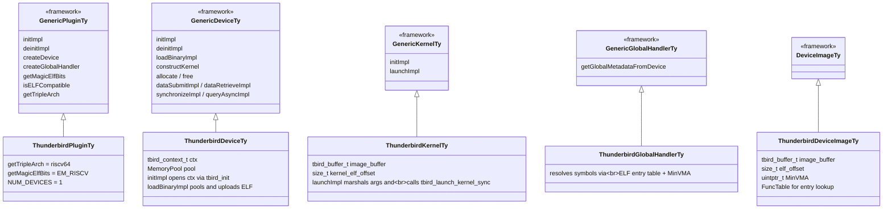
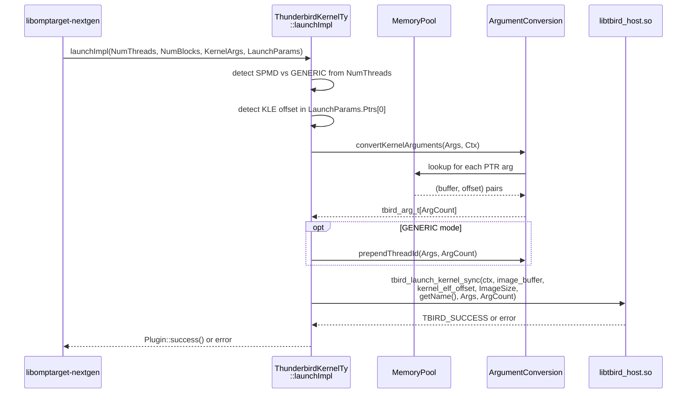

# Plugin Architecture

The Thunderbird plugin is a single translation unit —
`src/rtl.cpp` — plus two helper modules extracted for testability
(`MemoryPool.cpp` and `ArgumentConversion.cpp`, both covered in
[06](06_memory_pool_and_arg_conversion.md)). It implements the
libomptarget-nextgen plugin framework's five base classes and
hands all memory + data motion off to `libtbird_host.so` from the
offload-platform repo.

## Class hierarchy



Registration with libomptarget-nextgen is a single C-linkage
factory function at the bottom of `rtl.cpp`:

```cpp
extern "C" {
llvm::omp::target::plugin::GenericPluginTy *createPlugin_thunderbird() {
  return new llvm::omp::target::plugin::ThunderbirdPluginTy();
}
}
```

libomptarget discovers the plugin by name at load time, matches
device images by `getMagicElfBits()` returning `ELF::EM_RISCV`, and
gets a single device back (`THUNDERBIRD_NUM_DEVICES = 1`).

## Plugin lifecycle

`ThunderbirdPluginTy` is thin. It declares what it is, hands off
device-level work to `ThunderbirdDeviceTy`, and terminates.

```cpp
Expected<int32_t> initImpl() override {
#ifdef USES_DYNAMIC_FFI
  if (auto Err = Plugin::check(ffi_init(), "failed to initialize libffi"))
    return std::move(Err);
#endif
  return THUNDERBIRD_NUM_DEVICES;
}

Error deinitImpl() override { return Plugin::success(); }

GenericDeviceTy *createDevice(GenericPluginTy &Plugin, int32_t DeviceId,
                              int32_t NumDevices) override {
  return new ThunderbirdDeviceTy(Plugin, DeviceId, NumDevices);
}

uint16_t getMagicElfBits() const override { return llvm::ELF::EM_RISCV; }
bool isDataExchangable(int32_t, int32_t) override { return false; }
Triple::ArchType getTripleArch() const override { return llvm::Triple::riscv64; }
```

The `USES_DYNAMIC_FFI` conditional is a legacy hook that is
currently never defined in the plugin's CMake; the `dynamic_ffi/`
subdirectory is retained for historical reference but not part of
the current build.

`ThunderbirdDeviceTy::initImpl` is the real startup. It opens a
`tbird_context` through the offload-platform API and initialises
the memory pool:

```cpp
Error initImpl(GenericPluginTy &Plugin) override {
  const char *device_path = getenv("THUNDERBIRD_DEVICE_PATH");
  if (!device_path) device_path = "/dev/tbird0018-0";

  ctx = tbird_init(device_path, 1);
  if (!ctx)
    return Plugin::error(ErrorCode::UNKNOWN,
                         "Failed to initialize Thunderbird context: device=%s",
                         device_path);

  MaxNumThreads = THUNDERBIRD_MAX_THREADS;   // 6144
  pool.init(ctx);
  return Plugin::success();
}
```

`tbird_init` (from `libtbird_host.so`) opens the driver device
node, registers a single mailbox, and returns the opaque context
handle the rest of the plugin uses. See the sibling offload-platform repo's
`simplified-api/presentation_mats/02_host_api_surface.md` for
the API that's being called into here.

`deinitImpl` releases the pool (which issues `tbird_free_buffer`
for every slab) and returns; it does not close the `tbird_context`
(the OS cleans up the fd on process exit).

## Binary loading

`loadBinaryImpl` pools the device ELF and stages it in shared
memory so the device_server can `dlopen` it at launch time:

```cpp
Expected<DeviceImageTy *> loadBinaryImpl(const __tgt_device_image *TgtImage,
                                         int32_t ImageId) override {
  // ... validation elided ...

  size_t ImageSize = (const char*)TgtImage->ImageEnd - (const char*)TgtImage->ImageStart;

  // Allocate image through pool
  void *img_ptr = pool.allocate(ImageSize);
  if (!img_ptr)
    return Plugin::error(ErrorCode::OUT_OF_RESOURCES,
                         "pool.allocate failed for image (%zu bytes)", ImageSize);

  // Resolve slab buffer and offset for this sub-allocation
  auto [image_buf, elf_off] = pool.lookup(img_ptr);

  // Upload image to shared buffer at the pool-assigned offset
  tbird_status_t status = tbird_buffer_write(ctx, image_buf, elf_off,
                                             TgtImage->ImageStart, ImageSize);
  // ... error check elided ...

  // Store buffer + offset in image object, parse ELF for MinVMA, build
  // the function-table entry list, return the image.
  Image->image_buffer = image_buf;
  Image->elf_offset = elf_off;
  // ... PT_LOAD scan for MinVMA, makeFuncTable() ...
  return Image;
}
```

Noteworthy:

- **No per-ELF free.** The ELF slab is managed by the pool and
  released at `destroy()` time, not per-image. `unloadBinaryImpl`
  just clears the image's buffer reference.
- **MinVMA bookkeeping.** The ELF's `PT_LOAD` segments have
  virtual addresses assigned by lld; the minimum of those is
  stored on the image so symbol resolution in
  `ThunderbirdGlobalHandlerTy` can convert an entry's
  image-relative address into a host pointer for diagnostics.
- **FuncTable.** `makeFuncTable` walks the
  `offloading::EntryTy[]` in the device image and builds a
  `std::map<std::string, const EntryTy *>` for symbol lookup.
  libomptarget queries this via `getGlobalMetadataFromDevice`.

## Kernel launch

`ThunderbirdKernelTy::launchImpl` is the heart of the plugin.
Every `#pragma omp target` region the application runs ends up
here.



The pattern highlights:

- **Single call across the boundary.** `tbird_launch_kernel_sync`
  blocks until the device returns. The plugin is entirely
  synchronous; `synchronizeImpl`, `queryAsyncImpl`,
  `createEventImpl`, `recordEventImpl`, `waitEventImpl`,
  `syncEventImpl` are all no-ops that return success.
- **SPMD / GENERIC detection.** OpenMP-nextgen tells the plugin
  the team geometry in `NumThreads[3]` / `NumBlocks[3]`. A team
  of (1,1,1) means GENERIC mode — only one thread per team,
  typical of simple `#pragma omp target` with no inner parallel
  region. Non-unit sizes mean SPMD. GENERIC mode needs an extra
  thread-id first argument inserted via `prependThreadId`; SPMD
  mode passes arguments as-is.
- **KLE offset.** libomptarget may insert a
  `KernelLaunchEnvironment` pointer at `LaunchParams.Ptrs[0]`
  (detectable by the sentinel `~0ULL` as the first pointee). If
  present, the plugin records the offset so subsequent argument
  walking skips that slot.
- **Source of `ImageSize`.** `tbird_buffer_size(image_buffer)`
  returns the full slab size; the device_server uses
  `kernel_elf_offset` and the ELF header's own `p_memsz` / etc.
  to find the real bounds of this kernel's ELF inside the slab.

## Memory and data motion

Allocation and data transfer delegate to `MemoryPool` + the
`libtbird_host.so` read/write ioctls.

```cpp
void *allocate(size_t Size, void *, TargetAllocTy Kind) override {
  if (Size == 0) return nullptr;
  switch (Kind) {
  case TARGET_ALLOC_DEFAULT:
  case TARGET_ALLOC_DEVICE:
  case TARGET_ALLOC_SHARED:
  case TARGET_ALLOC_DEVICE_NON_BLOCKING:
    return pool.allocate(Size);
  case TARGET_ALLOC_HOST:
    return std::malloc(Size);
  }
  return nullptr;
}

int free(void *TgtPtr, TargetAllocTy Kind) override {
  switch (Kind) {
  case TARGET_ALLOC_DEFAULT:
  case TARGET_ALLOC_DEVICE:
  case TARGET_ALLOC_SHARED:
  case TARGET_ALLOC_DEVICE_NON_BLOCKING:
    pool.deallocate(TgtPtr);
    return OFFLOAD_SUCCESS;
  case TARGET_ALLOC_HOST:
    std::free(TgtPtr);
    return OFFLOAD_SUCCESS;
  }
  return OFFLOAD_FAIL;
}
```

Host allocations bypass the pool and use plain `malloc` / `free`;
they never cross to the device and don't need a slab.

Data motion uses the pool's interior-pointer lookup:

```cpp
Error dataSubmitImpl(void *TgtPtr, const void *HstPtr, int64_t Size,
                    AsyncInfoWrapperTy &AsyncInfoWrapper) override {
  auto [buffer, offset] = findContainingBuffer(TgtPtr);
  if (!buffer)
    return Plugin::error(ErrorCode::UNKNOWN,
                        "dataSubmit: pointer %p not in buffer registry", TgtPtr);

  tbird_status_t status = tbird_buffer_write(ctx, buffer, offset, HstPtr, Size);
  if (status != TBIRD_SUCCESS)
    return Plugin::error(ErrorCode::UNKNOWN,
                        "tbird_buffer_write failed: %s", tbird_last_error(ctx));
  return Plugin::success();
}

Error dataRetrieveImpl(...) {
  // Symmetric: pool.lookup -> tbird_buffer_read.
}
```

`findContainingBuffer(TgtPtr)` delegates to `pool.lookup(ptr)`,
which handles interior pointers correctly — an application that
takes a pointer to row 42 of a matrix and passes *that* to a BLAS
call still has its data motion routed to the right slab + offset.

## What isn't implemented

- `dataExchangeImpl` returns `UNSUPPORTED`. No peer-to-peer DMA
  between devices because there's only one Thunderbird device in
  the plugin.
- `dataLockImpl` is a no-op (`return HstPtr`) because shared
  memory is already accessible by both sides; no pinning is
  needed.
- `initAsyncInfoImpl` returns `UNSUPPORTED`; async operations
  aren't wired up. Everything is synchronous.
- Event API (`createEventImpl` / `recordEventImpl` / etc.) all
  succeed without doing anything; libomptarget-nextgen expects
  these to exist but the synchronous plugin has nothing to
  record.
- `initDeviceInfoImpl` is `UNSUPPORTED`; `obtainInfoImpl` returns
  a minimal `InfoTreeNode` with one entry: `"Device Type":
  "Thunderbird RISC-V-64bit"`.
- `shouldSetupDeviceEnvironment` and
  `shouldSetupDeviceMemoryPool` both return `false` — the plugin
  manages its own memory through the pool; libomptarget's
  default environment/pool setup would conflict.

## Build integration

`CMakeLists.txt` wires up three sources and a required
`OFFLOAD_PLATFORM_PATH`:

```cmake
add_target_library(omptarget.rtl.thunderbird THUNDERBIRD)

target_sources(omptarget.rtl.thunderbird PRIVATE
  src/rtl.cpp
  src/MemoryPool.cpp
  src/ArgumentConversion.cpp
)

set(OFFLOAD_PLATFORM_PATH "" CACHE PATH "Path to offload-platform repository")
if(OFFLOAD_PLATFORM_PATH)
  target_include_directories(omptarget.rtl.thunderbird PRIVATE
    ${OFFLOAD_PLATFORM_PATH}/simplified-api/include
    ${OFFLOAD_PLATFORM_PATH}/include
  )
  if(NOT LIBTBIRD_HOST_SO)
    set(LIBTBIRD_HOST_SO "${OFFLOAD_PLATFORM_PATH}/simplified-api/host/libtbird_host.so")
  endif()
  target_link_libraries(omptarget.rtl.thunderbird PRIVATE "${LIBTBIRD_HOST_SO}")
else()
  message(FATAL_ERROR "OFFLOAD_PLATFORM_PATH must be set for offload-platform API integration")
endif()
```

- **`OFFLOAD_PLATFORM_PATH`** must point at a checkout of the
  offload-platform repo so the plugin can include
  `tbird_offload_api.h` and `internal/tbird_types_internal.h`.
- **`LIBTBIRD_HOST_SO`** defaults to
  `${OFFLOAD_PLATFORM_PATH}/simplified-api/host/libtbird_host.so`
  but can be overridden — the meta-inspire Yocto recipe passes a
  staging-sysroot path here so the in-SDK `.so` is linked rather
  than the source-tree one.

The plugin builds as
`omptarget.rtl.thunderbird.so` (the `add_target_library` helper
handles naming). libomptarget-nextgen auto-discovers it at load
time.

**Source:** [`offload/plugins-nextgen/thunderbird/src/rtl.cpp`](../src/rtl.cpp),
[`offload/plugins-nextgen/thunderbird/CMakeLists.txt`](../CMakeLists.txt).
