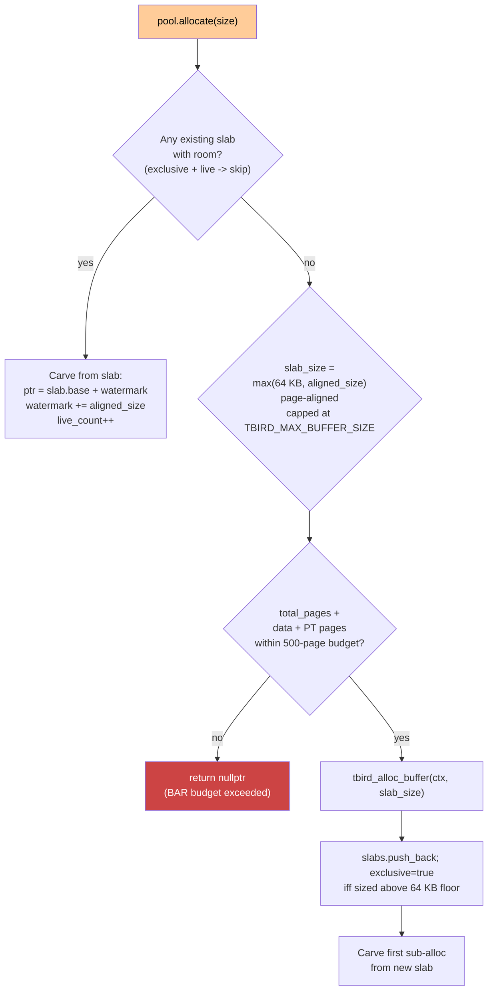
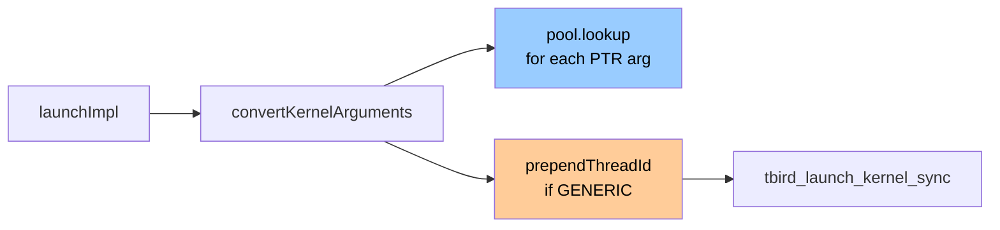

# MemoryPool and ArgumentConversion

Two helper modules sit under the plugin proper and handle the two
things the libomptarget-nextgen framework would otherwise leave as
O(N) trips across the ioctl boundary: every allocation and every
argument marshaling. Both are kept in their own translation units
so they can be tested in isolation without a running plugin.

## MemoryPool — why it exists

Every call into `tbird_alloc_buffer` is an ioctl into the kernel
driver. The driver allocates pages from the shared BAR, builds a
page table for them, and registers the buffer with the device. On
the device side, a `TBIRD_MBOX_SHARED_ADDED` event is emitted and
processed. That's a lot for one 4-byte scalar.

Without a pool, a SAXPY kernel launch costs:

- One ioctl for the ~217 KB ELF image.
- One ioctl for the x array (4 KB aligned, 1 page of data + 1 page
  of page-table = 8 KB consumed).
- One ioctl for the y array (same).
- One ioctl for the 4-byte scalar (still 4 KB + 4 KB = 8 KB
  consumed — a 2,048× overhead).

Four ioctls, 59 BAR pages consumed, 12 KB wasted on three tiny
data allocations. For a workload like HPL that issues hundreds of
BLAS calls against interior pointers of the same matrix, the
wastage compounds and exhausts the BAR budget long before the
workload is large enough to require it.

A full design walkthrough with before/after sequence diagrams
lives at [`docs/memory_pool_design.md`](../docs/memory_pool_design.md).
This document summarises the behaviour at the level the rest of
the plugin relies on.

## Pool shape



### Slab sizing

- **64 KB floor.** A small allocation (a scalar arg, a panel
  work-buffer) doesn't get its own slab; it lands in a 64 KB slab
  alongside its siblings. Packing small allocations together
  amortises the ioctl cost and saves the page-table overhead.
- **Request-sized for big allocations.** An allocation larger
  than 64 KB gets a slab sized exactly to it, rounded up to the
  page boundary and capped at `TBIRD_MAX_BUFFER_SIZE` (2 MiB, per
  offload-platform).
- **No stateful growth.** There's no "double slab size on each
  allocation" policy. Small requests always land in 64 KB slabs,
  big requests get their own slabs exactly.

### The `exclusive` flag

A slab that got upsized beyond the 64 KB floor for one big
allocation is marked exclusive. It won't accept small sibling
sub-allocations while the big tenant is live:

```cpp
for (size_t i = slabs.size(); i > 0; i--) {
  Slab &s = slabs[i - 1];
  if (s.exclusive && s.live_count > 0)
    continue;        // big tenant still live — don't pollute
  if (s.watermark + aligned <= s.capacity) {
    // carve from this slab
    ...
  }
}
```

The motivation is reclamation. If a slab has ten live
sub-allocations of different sizes, none of them can be freed
independently; the slab's `live_count` stays > 0 and its watermark
never resets. With exclusive marking, the pattern "big one-shot
tenant (HPL matrix, ELF image), then small siblings pack in after
it frees" becomes possible — because the small siblings can't
pin the slab while the big tenant is still there.

### Reclamation

```cpp
void MemoryPool::deallocate(void *ptr) {
  auto it = allocations.find(ptr);
  if (it != allocations.end()) {
    size_t idx = it->second.slab_idx;
    allocations.erase(it);
    if (--slabs[idx].live_count == 0) {
      slabs[idx].watermark = 0;   // slab fully drained → watermark resets
    }
  }
}
```

Individual `.a` archives never get freed back to the driver; what
*does* happen is that a slab whose tenants all leave has its
watermark reset to 0 and becomes fully reusable for new
allocations. The HPL residual-check phase uses this pattern: the
solve-phase matrix exits, its slab drains, and the residual buffer
lands in the same slab instead of forcing a new one.

All slabs are released to the driver only at `destroy()` time
(`deinitImpl`), when the plugin is shutting down.

### Budget

```cpp
static constexpr size_t MAX_POOL_PAGES = 500;
```

The 4 MiB BAR contains ~1018 usable pages. Up to two concurrent
mailboxes can co-exist on one BAR, so each pool instance caps its
total footprint at ~half — 500 pages, ~2 MiB. This matches the
`TBIRD_MAX_BUFFER_SIZE` ceiling coincidentally; the pool budget is
in place so two simultaneous plugin instances can each allocate
their full 2 MiB buffer without colliding.

Exceeding the budget returns `nullptr` from `allocate`; the
framework treats that as an out-of-memory condition.

### Interior-pointer lookup

```cpp
std::pair<tbird_buffer_t, size_t> MemoryPool::lookup(void *ptr) {
  // Fast: exact match
  auto it = allocations.find(ptr);
  if (it != allocations.end()) { ... return {buffer, offset}; }
  // Slow: interior pointer
  for (auto &[base, sub] : allocations) {
    if (addr >= base_addr && addr < base_addr + sub.size)
      return {slabs[sub.slab_idx].buffer, sub.offset + (addr - base_addr)};
  }
  return {nullptr, 0};
}
```

Every `dataSubmitImpl` / `dataRetrieveImpl` call goes through
`lookup`. The fast path is a `std::unordered_map` lookup by exact
pointer; the slow path scans every known allocation to find one
whose byte range contains the pointer. For a pointer to row 42 of
a matrix, the slow path resolves to the matrix's slab + offset,
which is exactly what `tbird_buffer_write` needs.

This is the plugin-side mirror of offload-platform's
`tbird_identify_ptr`; see the sibling offload-platform repo's
`simplified-api/presentation_mats/08_addressing.md` for the
wire-level picture.

**Source:** [`offload/plugins-nextgen/thunderbird/src/MemoryPool.h`](../src/MemoryPool.h),
[`offload/plugins-nextgen/thunderbird/src/MemoryPool.cpp`](../src/MemoryPool.cpp),
[`offload/plugins-nextgen/thunderbird/docs/memory_pool_design.md`](../docs/memory_pool_design.md).

## ArgumentConversion — OpenMP to tbird_arg_t

The libomptarget-nextgen framework hands `launchImpl` a
`KernelArgsTy` that looks like this:

- `NumArgs` — number of arguments (potentially including a
  framework-injected `KernelLaunchEnvironment` pointer at index 0).
- `ArgPtrs[]` — host pointers to each argument's storage.
- `ArgTypes[]` — OpenMP map-type bitfield per argument
  (`TO`/`FROM`/`LITERAL`/etc.).
- `ArgCTypes[]` — OpenMP C type enum per argument.

The plugin has to rewrite this into `tbird_arg_t[]`, which is what
the offload-platform launch API accepts. The types don't line up
one-to-one — the OpenMP type numbering isn't the same as
`tbird_arg_type_t`, pointer arguments need `pool.lookup` for
buffer-handle+offset translation, and GENERIC mode needs an extra
thread-id argument inserted at position 0.

`ArgumentConversion.cpp` does exactly that.

### Type mapping

```cpp
tbird_arg_type_t convert_omp_ctype_to_tbird(uint8_t omp_ctype) {
  switch (omp_ctype) {
    case 0:  return TBIRD_TYPE_VOID;   // padding / internal
    case 1:  return TBIRD_TYPE_INT8;
    case 2:  return TBIRD_TYPE_UINT8;
    case 3:  return TBIRD_TYPE_INT16;
    case 4:  return TBIRD_TYPE_UINT16;
    case 5:  return TBIRD_TYPE_INT32;
    case 6:  return TBIRD_TYPE_UINT32;
    case 7:  return TBIRD_TYPE_INT64;
    case 8:  return TBIRD_TYPE_UINT64;
    case 9:  return TBIRD_TYPE_FLOAT;
    case 10: return TBIRD_TYPE_DOUBLE;
    case 11: return TBIRD_TYPE_POINTER;  // -> TBIRD_TYPE_PTR
    default: return TBIRD_TYPE_INT64;  // safety fallback
  }
}
```

VOID arguments aren't errors — libomptarget uses them as padding
or internal markers. The conversion loop skips them without
incrementing the output index.

### The conversion loop

```cpp
Expected<uint32_t> convertKernelArguments(tbird_arg_t ArgsOut[TBIRD_MAX_ARGS],
                                          const ArgConversionContext &Ctx) {
  uint32_t OrigNumArgs = Ctx.KernelArgs.NumArgs - Ctx.KLEOffset;
  memset(ArgsOut, 0, sizeof(tbird_arg_t) * TBIRD_MAX_ARGS);
  uint32_t ActualArgCount = 0;

  for (uint32_t i = 0; i < OrigNumArgs; i++) {
    uint8_t OmpCType = Ctx.KernelArgs.ArgCTypes ? Ctx.KernelArgs.ArgCTypes[i] : 11;
    tbird_arg_type_t TbirdType = convert_omp_ctype_to_tbird(OmpCType);

    if (TbirdType == TBIRD_TYPE_VOID)
      continue;                       // skip padding/internal args

    ArgsOut[ActualArgCount].type = TbirdType;

    auto [MapType, HasMapType] = getArgMapType(i, Ctx);

    Error Err = (TbirdType == TBIRD_TYPE_PTR)
      ? convertPointerArgument(i, ArgsOut[ActualArgCount], Ctx)
      : convertScalarArgument(i, ArgsOut[ActualArgCount],
                              MapType, HasMapType, Ctx);
    if (Err) return std::move(Err);

    ActualArgCount++;
  }

  return ActualArgCount;
}
```

The `KLEOffset` handling is a subtlety:
libomptarget-nextgen may prepend a `KernelLaunchEnvironment` pointer
at `LaunchParams.Ptrs[0]`, marked by a `~0ULL` sentinel, and
simultaneously bump `KernelArgs.NumArgs` by one — but it does
*not* extend the `ArgTypes` / `ArgCTypes` / `ArgPtrs` metadata
arrays. The plugin subtracts `KLEOffset` to recover the number of
genuine arguments and walks those. The KLE pointer itself is
handled elsewhere — the plugin doesn't pass it to the kernel.

### Pointer arguments

`convertPointerArgument` dereferences the host pointer (because
`ArgPtrs[i]` points *to* the pointer argument, not *is* the
pointer argument) and asks the pool where that device address
came from. The output slot's `value.ptr` gets the raw device
virtual address — not a `(buffer, offset)` pair. The
`(buffer, offset)` translation happens inside
`tbird_launch_kernel_sync` using the pool's same lookup call
chain.

### Scalar arguments

`convertScalarArgument` handles three flavours:

- **Pure literal** (`LITERAL` bit set in `MapType`): the scalar
  value is stored directly in `ArgPtrs[i]` as a pointer-sized
  integer. Copy the bytes into `scalar_bytes` with the right
  size from `getScalarSize(TbirdType)`.
- **By-reference scalar** (no `LITERAL` bit): `ArgPtrs[i]` points
  at the scalar's host storage; dereference and copy the bytes.
- **Promoted pointer** (rare): some edge cases where a scalar
  type has been upgraded to `TBIRD_TYPE_PTR` by the backend; the
  conversion falls back to the pointer path.

### GENERIC-mode thread-id

Plain `#pragma omp target` with no inner parallelism is a GENERIC
kernel — one team, one thread per team. The runtime expects the
kernel to receive a thread id as its first argument (by
convention, id = 0 in GENERIC mode). `prependThreadId` inserts
it:

```cpp
void prependThreadId(tbird_arg_t Args[TBIRD_MAX_ARGS], uint32_t &ArgCount) {
  // Shift all arguments forward by one
  for (uint32_t i = ArgCount; i > 0; i--)
    Args[i] = Args[i-1];

  Args[0].type = TBIRD_TYPE_INT64;
  memset(Args[0].value.scalar_bytes, 0, sizeof(Args[0].value.scalar_bytes));
  ArgCount++;
}
```

SPMD mode kernels skip this step — their team geometry carries the
thread-id implicitly and the first argument is the kernel's own
parameter as-declared.

## The two modules together



MemoryPool is the quiet partner: every pointer argument's
translation depends on it having tracked the allocation
correctly, every data transfer asks it to find a buffer handle.
ArgumentConversion is the louder one: a bug in its type
mapping, `LITERAL`-bit handling, or GENERIC-mode thread-id
insertion manifests directly as a kernel receiving the wrong
values.

Both modules are deliberately independent of the plugin
interface classes. `MemoryPool` takes only a `tbird_context_t`
and the offload-platform API; `ArgumentConversion` takes a
`MemoryPool&` and the libomptarget `KernelArgsTy`. Neither
depends on `ThunderbirdDeviceTy`. That's how the plugin's unit
tests (not part of the presentation_mats scope) can exercise
them without spinning up a live Thunderbird context.

**Source:** [`offload/plugins-nextgen/thunderbird/src/ArgumentConversion.h`](../src/ArgumentConversion.h),
[`offload/plugins-nextgen/thunderbird/src/ArgumentConversion.cpp`](../src/ArgumentConversion.cpp),
[`offload/plugins-nextgen/thunderbird/src/MemoryPool.h`](../src/MemoryPool.h),
[`offload/plugins-nextgen/thunderbird/src/MemoryPool.cpp`](../src/MemoryPool.cpp),
[`offload/plugins-nextgen/thunderbird/docs/memory_pool_design.md`](../docs/memory_pool_design.md).
